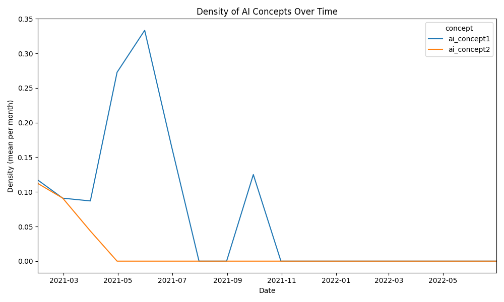

# comm4190_F25_TikTok_Task
TikTok task for COMM 4190 at UPenn

## Group
- Eric Zou
- Parsa Idehpour

## Overview
This project utilized AI-assisted quantitative coding to label a dataset of selected TikTok comments from a sufficiently popular video containing a non-political difference in opinions. First, we decided on a research question to tackle within the data. Then, we manually coded 100 comments to establish a baseline and refine concepts used in generating a prompt for an AI assistant to follow. We iterated on the prompt till the LLM evaluator was sufficiently aligned on test data. Then, we use AI to label all 1000 comments in the data and completed the analysis required to gather evidence to answer our research question.

## Video
[popcorn chicken is better than regular popcorn](https://www.tiktok.com/@nick.digiovanni/video/6915887479237266694) by [nick.digiovanni](https://www.tiktok.com/@nick.digiovanni)

Date: 01-09-2021

This is a video showing Nick making popcorn chicken in his studio. Some highlights include using pickle juice, his signature knife toss, and using ketchup and mayo for the sauce.
### Stats (as of 11/23)
- Likes: 628.3k
- Comments: 3.09k
- Saves: 26.3k
- Shares: 7.7k

## Research Question
How does the prevalence of preferring versus disliking the topic of the video (popcorn chicken) evolve over time with the comments

## Concepts

### Concept 1
A negative reaction to the video and/or the topic of popcorn chicken. This includes equating popcorn chicken to chicken nuggets,
argues about a flaw in the video or dismisses the concept, or favors popcorn (mentioned in the description)

### Concept 2
A positive reaction to the video and/or the topic of popcorn chicken. This includes aligning with the sauce choice in the video, mentioning 
liking popcorn chicken, or mentioning another Tiktok user.

### Evolution
We realized that there were a lot of edge cases that we needed to explicitly consider during the first few rounds of coding. Things like commenting on the quality of the sauce were interpreted to signal something about how much a user actually liked the video. We also had to handle cases where the topic of the video was implicitly reduced to another concept like chicken nuggets in our evaluation. Another example is tagging a friend, which signals interest in the video with high probability. The description of each concept got more fleshed out until we decided not to pursue opinionated views on concepts like comments solely on the knife tossing, otherwise this may have added complexity to the LLMs task.

## LLM Coding Results

### Final Prompt

You are a research assistant performing a quantitative coding task. 
You will receive a series of comments on a TikTok short video recipe for popcorn chicken from the Nick DiGiovanni channel.
You are given the following concepts:

Concept 1: 
A negative reaction to the video and/or the topic of popcorn chicken. This includes equating popcorn chicken to chicken nuggets,
argues about a flaw in the video or dismisses the concept, or favors popcorn (mentioned in the description)

Concept 2: 
A positive reaction to the video and/or the topic of popcorn chicken. This includes aligning with the sauce choice in the video, mentioning 
liking popcorn chicken, or mentioning another Tiktok user.

Requests for other videos are not considered as belonging to either concept

### Agreement with Our Coding
```
Krippendorff’s Alpha between Human and AI:
• Concept 1: 0.730
• Concept 2: 0.759
```

## Prompting Strategies

We started with a prompt that basically just had a short description of the task, no video context, and the concepts without any structure. This resulted in poor scores. 

We then tried to add a bunch of rules thinking it would help. However, I think the number of rules and the lack of prioritization also impacted the AI's performance, which meant we disagreed on certain edge cases. Example rules included: 
* Requests for other videos are not considered as belonging to either concept
* If it is unclear whether or not something is positive or negative, please don't mark either concept (mentioning dents in a cutting board)
* If a question is posed pertaining to these concepts, mark none
* If a comment is incomplete, do not make assumptions on how to interpret it

Eventually, we only kept one of these rules (video requests) due to its broad applicability in the data, and made sure the prompt was structured well, with labels for each concept, a more specific task description (research assistant working on quantitative coding instead of just a research assistant), and a better description of the video in the context window.

## Research Question Charts



## Findings

In the early part of 2021, both concepts within these comments begin at roughly the same level, but their trajectories quickly diverge. Concept one grows steadily and reaches a clear mid-year peak before tapering off, while concept two steadily declines and drops to zero by late spring. This pattern suggests that concept one remained an active theme in the underlying discussion, while concept two appeared briefly and then faded out.

The combination analysis helps confirm this interpretation. When we look at which pairs of concepts appear together, we see that the "10" combination shows up repeatedly, meaning concept one appears by itself in many sampled comments. By contrast, the "01" combination appears only early on and then disappears. At the same time, the "00" combination grows dominant later in the year, reflecting a steady increase in comments that include neither concept as both signals become sparse. Taken together, these cleaned visualizations tell a consistent story. Concept one shows recurring bursts of activity throughout the main period of interest, while concept two remains rare and never resurfaces after its initial decline. The two concepts do not rise or fall together, and they do not co-occur in any of the sampled comments. Removing the outliers helped reveal a simpler and more coherent pattern, making it clear that concept one has a sustained presence in the dataset, whereas concept two plays only a minor role.

Of course, the main limitation of the analysis is how good of a representation these selected comments are of the whole. Since we only select 1 in 3 comments, and these selections are not made at random and are instead retrieved from the API, we can't make a good conclusion about the entire dataset. However, we can conclude that there is a significant portion of the commenters at the beginning of the video's lifetime that expressed some dislike toward the video or its concept. There were however still positive presences in the video comments despite being less represented in the data past the first two months.
